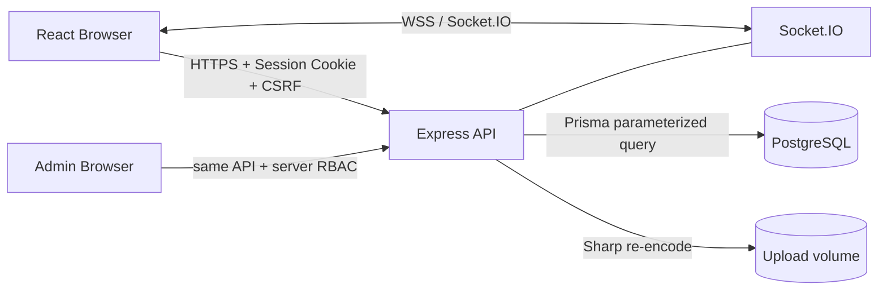
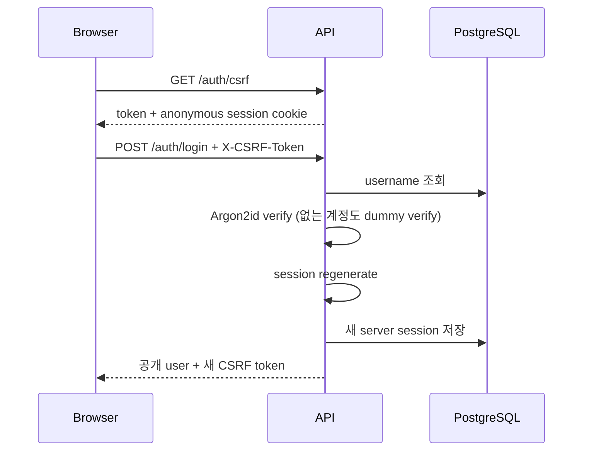
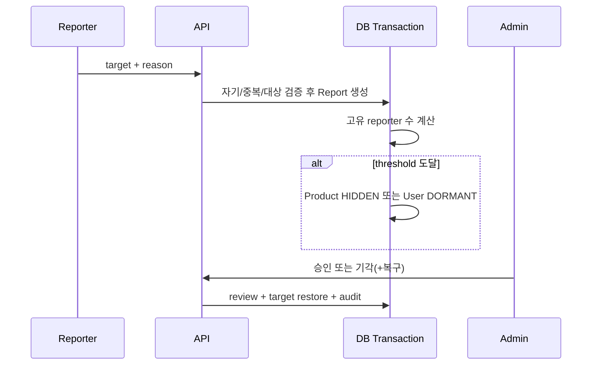
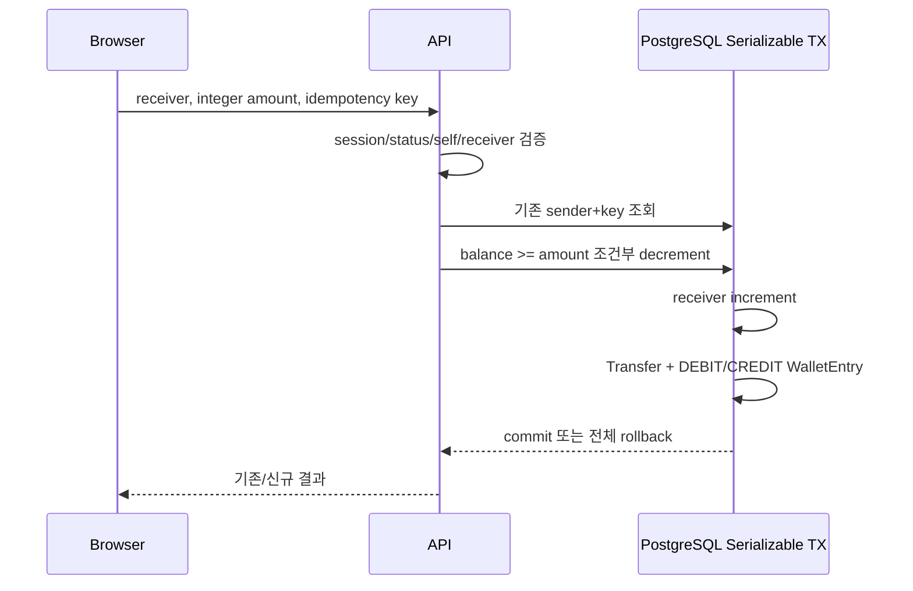
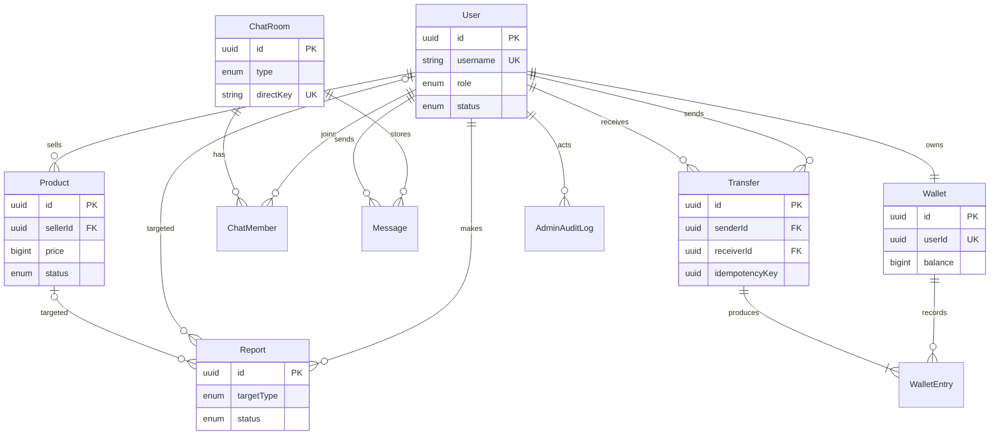

# 시스템 설계

## 전체 아키텍처

브라우저는 식별자·가격·잔액·role을 결정하지 않는다. API가 세션의 userId와 DB의 최신 상태를 기준으로 권한을 계산한다. Web과 API는 npm workspace로 분리되고 Zod 스키마만 `packages/shared`에서 공유한다.

## 프론트엔드와 백엔드

- `App.tsx`: route, layout, 인증/관리자 guard
- `pages.*.tsx`: 인증, 상품, 채팅, 지갑, 관리자 기능 단위 화면
- `api.ts`: credentials/CSRF/공통 오류 처리
- API route: 입력 파싱, 인가, 트랜잭션 조정
- `chat-service.ts`: REST와 Socket이 공유하는 방 권한/메시지 저장
- `http.ts`: 공통 오류, 인증/RBAC, CSRF, BigInt 직렬화
- Prisma: 관계·unique·index, migration SQL: check/partial unique 보강

## 데이터 흐름

### 로그인

### 채팅

Socket handshake에서 정확한 Origin, PostgreSQL session, ACTIVE 상태를 검증한다. `room:join`은 GLOBAL 또는 `ChatMember` 존재 여부를 재검증한다. senderId는 payload가 아니라 session에서 가져온다. 메시지는 500자 Zod와 사용자별 10초 bucket을 통과한 뒤 DB에 저장·broadcast한다. 브라우저는 same-origin Socket proxy를 사용하며 연결 중단이나 acknowledgement timeout 시 같은 `clientMessageId`로 REST 저장을 재시도한다. `(senderId, clientMessageId)` UNIQUE와 upsert가 중복 저장을 방지하고 REST도 같은 membership 검사를 거친다.

### 신고와 자동조치

### 송금

동시 충돌(P2034)은 409로 반환하며 클라이언트가 새 요청으로 재시도한다. DB check constraint도 음수 잔액과 비양수 금액을 거부한다.

## ERD

## 주요 설계 결정과 대안

| 결정                           | 선택 이유                                  | 배제한 대안           |
| ------------------------------ | ------------------------------------------ | --------------------- |
| 서버 session + HttpOnly cookie | 즉시 폐기·상태 재검증, JS 토큰 탈취 축소   | localStorage JWT      |
| Prisma + DB constraints        | query parameterization과 앱/DB 이중 방어   | 문자열 raw SQL        |
| BigInt 원장                    | KRW 정수 정확성, 감사 가능성               | JS float, 잔액만 변경 |
| Serializable + 조건부 차감     | 동시 이중 지출과 음수 방지                 | 읽고 계산 후 update   |
| Sharp WebP 재인코딩            | signature 확인, 메타데이터 제거, 안전 이름 | 원본 이름/바이트 저장 |
| 임시 자동조치 + 사람 검토      | 신고 남용 피해 완화                        | 횟수 기반 영구 삭제   |
| 단일 GLOBAL room lazy 생성     | 배포/테스트 단순화                         | 하드코딩 room id      |

## 관리자 흐름

UI route guard는 편의 기능이고 보안 경계는 `requireAdmin`이다. 모든 상태 변경은 대상 현재값을 읽고 변경한 뒤 `AdminAuditLog`에 관리자, action, target, 전후 JSON, 시각을 기록한다. 자기 관리자 계정 비활성화는 막는다.
