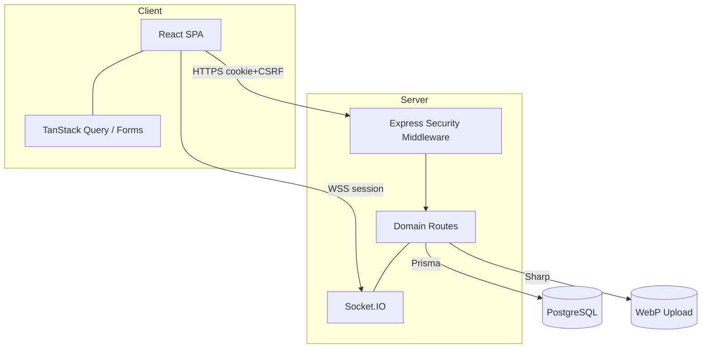
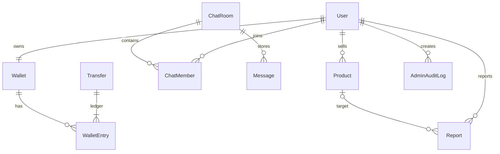
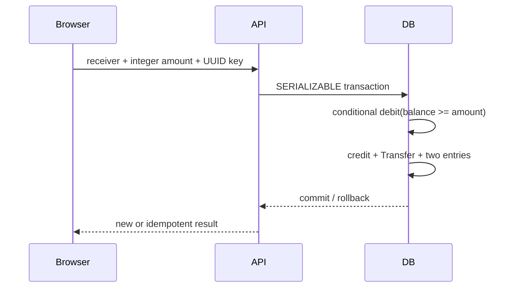

# Tiny Second-hand Shopping Platform 최종 보고서

## 1. 프로젝트 개요

Tiny Market은 사용자 가입, 중고 상품과 안전한 이미지, 검색, 실시간 대화, 신고/임시차단, 교육용 데모 송금, 관리자 검토를 제공하는 React·Express·PostgreSQL 모노레포다. 화면과 보고서는 한국어이며 로컬/Docker/CI 실행을 제공한다.

> **본 지갑은 교육용 데모 기능이며 실제 화폐나 금융기관과 연결되지 않습니다.**

## 2. 개발 목표

단순 목업이 아니라 실제 DB transaction과 서버 권한 검사가 작동하는 최소 완성 플랫폼, 공격 표면을 명시적으로 통제하는 secure-by-design 구현, 실행 결과를 과장하지 않는 검증·유지보수 문서를 목표로 했다.

## 3. 요구사항 분석

핵심 기능은 FR-1 인증/사용자, FR-2 상품, FR-3 전체·1:1 채팅, FR-4 신고/차단, FR-5 데모 송금, FR-6 검색, FR-7 관리자다. 비기능 요구는 반응형 접근성, 재현 가능 Docker/seed/migration, strict type/자동화/감사 가능성이다. 세부 수용 기준과 추적은 `REQUIREMENTS.md`에 있다.

| 분류          | 완료                | 근거                                  |
| ------------- | ------------------- | ------------------------------------- |
| 핵심 기능 7종 | 구현 완료           | API route, React pages, Prisma models |
| 필수 페이지   | 구현 완료           | React Router 및 403/404               |
| 보안 통제     | 구현 완료/운영 일부 | middleware, DB checks, threat model   |
| 자동화        | 실행 완료           | 12 unit/integration/UI + 1 E2E        |
| 배포 준비     | 구현 완료           | Docker, CI, CodeQL, Dependabot        |

## 4. 요구사항 변경 및 추가 사유

개인정보 최소화를 위해 선택적 이메일은 수집하지 않았다. 상품 이미지는 최소 대표 1개로 구현했다. 신고 자동조치는 영구 삭제가 아닌 HIDDEN/DORMANT이고 기각/상태 API로 복구한다. Socket 재연결 중 메시지 유실을 막기 위해 동일 membership 검사를 쓰는 REST 저장 fallback을 추가했다.

## 5. 시스템 아키텍처

브라우저/API, API/DB, 일반/관리자, HTTP/Socket, upload가 주요 신뢰 경계다. 서버만 user identity, role, ownership, membership, balance를 결정한다.

## 6. 페이지 및 API 설계

공개 영역은 홈, 가입/로그인, 상품 목록/검색/상세, 공개 프로필이다. ACTIVE 사용자 영역은 상품 등록/수정/내 상품, 마이페이지, 전체/1:1 채팅, 신고, 지갑/확인/내역이다. ADMIN 영역은 dashboard, 사용자, 상품, 신고, 채팅, 송금이며 UI guard와 독립된 서버 RBAC를 적용했다.

REST는 `/api/auth`, `/users`, `/products`, `/chats`, `/reports`, `/wallet`, `/admin`으로 분리하고 오류 code/message/requestId를 통일했다. Socket event는 `room:join`, `message:send`, `message:new`이며 senderId는 받지 않는다.

## 7. 데이터베이스 설계

UUID PK, username/wallet/directKey/idempotency unique, 생성일/상태/room/message index를 둔다. migration은 양수 가격/금액, 비음수 잔액, 자기 송금 금지, report target XOR와 partial unique를 DB에서도 강제한다.

## 8. 인증·인가 설계

JWT localStorage 대신 connect-pg-simple server session과 `tiny.sid` HttpOnly cookie를 사용한다. 로그인은 없는 계정도 dummy Argon2 verify 후 일반화 오류를 내며 성공 시 session을 재생성한다. 상태 변경은 session-bound CSRF token이 필요하다. 비밀번호 변경은 30분 내 재인증, 현재 암호 확인, 변경 후 해당 사용자의 모든 session 삭제를 수행한다. `requireAuth`가 매 요청 DB의 ACTIVE 상태를, `requireAdmin`이 role을 확인한다.

## 9. 상품 관리 구현

상품 CRUD와 soft delete, ACTIVE 공개 조회, owner/admin 변경, 검색어·가격·정렬·page size Zod, Prisma contains query를 구현했다. BigInt 가격은 문자열로 반환한다. 설명/이름은 React 일반 text로만 표시한다.

이미지는 declared MIME 선검사 후 Sharp 실제 decode format/pixel을 확인하고 rotate/resize/WebP 재인코딩한다. 원본 이름을 버리고 UUID를 사용하며 DB 실패/교체 오류에서 새 파일을 정리한다.

## 10. 실시간 채팅 구현

GLOBAL room은 lazy 생성하고 direct room은 정렬된 두 UUID의 `directKey` unique로 중복을 막는다. REST/Socket은 `chat-service`의 membership과 ACTIVE 검사를 공유한다. handshake는 server session과 정확한 Origin을 검증하고 메시지는 500자·사용자별 bucket을 적용한 뒤 저장/broadcast한다. 개발/E2E에서 실제 Socket 연결을 검증했다.

## 11. 신고 및 차단 구현

신고자는 session으로 식별한다. 자신/본인 상품, 잘못된 target 조합, 동일 target 재신고를 차단한다. transaction 안에서 report를 만들고 고유 수가 환경 임계에 도달하면 상품 HIDDEN/사용자 DORMANT로 바꾼다. 관리자는 승인 또는 기각+복구하고 감사 로그를 남긴다.

## 12. 데모 지갑 및 송금 구현

JS 부동소수점을 피하고 Zod integer→BigInt를 사용한다. sender+key unique, DB balance check, 한 transaction의 두 wallet/transfer/entries로 replay와 race를 방어한다. conflict는 안전하게 rollback하고 409로 알린다. Transfer/Entry 수정·삭제 API는 없다.

## 13. 관리자 기능 구현

사용자/상품 전체 조회·상태 변경, 신고 검토/복구, 메시지 hide, 송금 읽기, 통계 5종, 감사 로그를 구현했다. 현재 관리자 자기 계정 비활성화를 막는다. 전후 JSON, action, target, admin, createdAt이 보존된다.

## 14. 시큐어 코딩 적용 내용

| 계층   | 통제                                                                  |
| ------ | --------------------------------------------------------------------- |
| 입력   | 공용 Zod, ID/길이/range/enum/page allowlist, body limit               |
| 인증   | Argon2id, generic login, server session, regenerate/destroy, CSRF     |
| 인가   | DB 최신 status/role, owner/member, own wallet history                 |
| 출력   | React escaping, no dangerous HTML, CSP, 공통 오류                     |
| DB     | Prisma, raw SQL 없음(세션 삭제는 `$1` binding), unique/check/FK/index |
| 파일   | byte/pixel/format, decode/reencode, metadata removal, UUID            |
| API    | Helmet, exact CORS, timeout/rate, request ID, Pino redact             |
| Socket | Origin/session/status/member/sender/rate 검증                         |
| 공급망 | pinned lock, audit 0, Dependabot/CodeQL/CI                            |

## 15. 위협 모델

계정/session, 개인 chat, 상품, 신고, wallet/ledger, admin을 보호 자산으로 두고 credential stuffing, fixation, CSRF/XSS/SQLi, IDOR/mass assignment, upload, spam/report abuse, replay/race, privilege escalation, log leakage, supply chain을 분석했다. 통제와 잔여 위험은 `THREAT_MODEL.md`에 상세 기록했다.

## 16. 개발 과정에서 발견한 보안 약점

실제 발견 사항은 nullable report unique 부족, password 변경 session 잔존 가능성, 비활성 session의 일부 auth mutation, 공급망 12건, runtime dev dependencies 등이다. 기능 결함으로 image field strip, Socket reconnect 무응답, 테스트 runner 경계도 발견했다.

## 17. 보안 약점 수정 전·후 비교

| 전                                          | 후                                             |
| ------------------------------------------- | ---------------------------------------------- |
| 앱 중복 query만                             | DB partial unique + transaction                |
| password hash만 교체                        | parameter binding으로 모든 사용자 session 삭제 |
| 일부 auth route userId만 검사               | 공용 ACTIVE guard                              |
| read/calculate/write 잔액 가능성            | Serializable conditional debit + checks        |
| 오래된 Critical/High tool/upload/image deps | 안전 버전 pin, audit 0                         |
| runtime 전체 node_modules                   | prod prune stage                               |

전체 표는 `SECURITY_CHANGES.md`에 있다.

## 18. 체크리스트

인증, 상품, 채팅, 신고, 송금, 관리자, 공통 보안, 품질을 `CHECKLIST.md`에서 근거별 PASS/PARTIAL로 기록했다. 단일 노드 rate limiter, 사용자 휴면 전용 자동 test, 운영 TLS/object storage는 PARTIAL/운영 확인 대상으로 남겼다.

## 19. 자동화 테스트

- Supertest 7: 인증/CSRF, CRUD/IDOR/XSS/SQLi, 업로드 signature, 신고, chat membership/RBAC, 송금 동시성
- RTL 6: login/signup/product validation, API error, admin menu, wallet warning/confirm
- Playwright 1: A 가입·상품→B 검색·Socket chat·신고·송금→admin 검토→B admin 403
- ESLint, strict TypeScript, Vite/API build, npm audit

## 20. 수동 테스트

한국어 오류, 데모 경고, 폼 label/alt/focus, 반응형 CSS, 신고 경고, 관리자 위험 경고, 403/404를 Chromium 흐름과 코드 검토로 확인했다. 실제 모바일 기기/보조기술/production TLS는 미검증이다.

## 21. 테스트 결과와 수정 내역

최종 `format:check`, `lint`, `typecheck`, `test`, `test:e2e`, `build`가 exit 0이고 `audit`가 취약점 0건이다. Docker build가 성공했고 DB/API/Web은 healthy, migrate는 exit 0이다. 초기 실패와 원인/수정/재테스트는 `TEST_REPORT.md`에 숨김없이 기록했다.

## 22. 유지보수 계획

중앙 JSON 로그와 security event, encrypted backup/PITR/복구 훈련, append-only migration, session cleanup, orphan upload lifecycle, audit review, report threshold change control, incident procedure, TLS/WSS, object storage 전환을 `MAINTENANCE.md`에 정의했다.

## 23. 알려진 제한사항

- 이메일 검증/복구와 MFA가 없다.
- 상품 이미지는 대표 1개, 로컬 volume 저장이다.
- rate limiter와 Socket adapter는 프로세스 메모리 기반이라 다중 노드 공유가 안 된다.
- 신고 Sybil 탐지, malware sandbox, 관리자 review memo/appeal이 없다.
- E2E는 Chromium 1종이고 테스트 데이터 cleanup fixture가 없다.
- 브라우저 기본 confirm을 접근성 높은 custom dialog로 개선할 수 있다.

## 24. 향후 개선사항

Redis adapter/store, MFA/SSO, object storage+scan, multi-image, notification, report appeal, OpenTelemetry/SIEM, multi-browser/visual/a11y automation, ledger reconciliation job을 우선순위화한다.

## 25. GitHub Repository 링크

`https://github.com/<OWNER>/tiny-secondhand-secure-platform`

현재 환경에서 실제 public repository push 성공 여부는 최종 작업 단계에서 확인하며, 인증이 없다면 위 placeholder를 유지하고 정확한 게시 명령을 제공한다.

## 부록: 상태 구분

- **구현 완료:** 핵심 7기능, 필수 페이지, DB/migration/seed, 보안 middleware, Docker/CI, 자동화
- **부분 구현:** 단일 노드 rate/Socket scale, 일부 세부 전용 자동 test
- **미구현:** MFA, 실제 금융, object storage, malware service (의도적 범위 밖)
- **운영 추가 필요:** HTTPS/WSS, secret manager, backup/restore, monitoring/SIEM, distributed infrastructure
